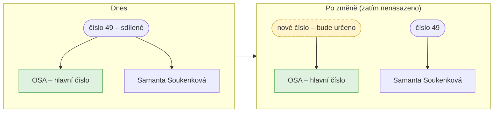
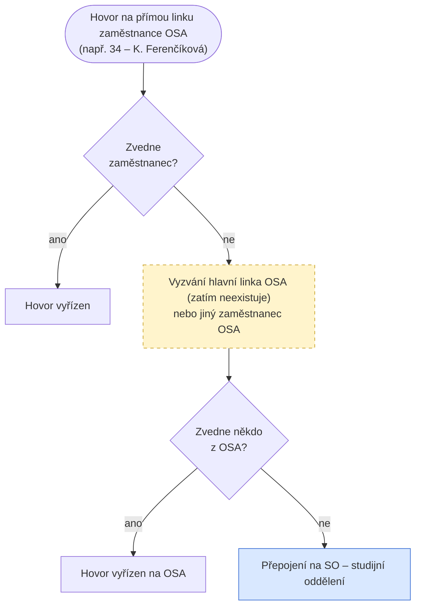

# Směrování příchozích hovorů (SO / OSA / CSP)

Jak se rozřazují příchozí hovory mezi oddělení podle toho, v jakém stavu je volající
v našem číselníku. Platí pro volání na kteroukoli z těchto klapek:

| Oddělení | Klapka |
|---|---|
| **SO** – studijní oddělení | `11` |
| **OSA** | `49` — dnes sdílené se Samantou Soukenkovou, viz [plánované rozdělení](#planovana-zmena-rozdeleni-cisla-49) |
| **CSP** | `00` |

---

## Hlavní rozřazení podle stavu volajícího

> ⚠️ **Dnes platí:** kdo je „přijat a dále", padá **vždy rovnou na CSP**.
> IVR rozcestník níže zatím neexistuje.

## Plánované rozšíření: IVR rozcestník pro přijaté

Až bude rozcestník nasazen, přijatí volající nespadnou rovnou na CSP, ale nejdřív
uslyší volbu:

## Plánovaná změna: rozdělení čísla 49 (OSA / Samanta Soukenková)

Číslo `49` je dnes **sdílené** — funguje jako hlavní (globální) číslo OSA a zároveň jako
číslo Samanty Soukenkové. Plán je to rozdělit:

- **OSA** dostane **nové číslo** *(zatím není určeno)*,
- `49` zůstane **pouze Samantě Soukenkové**.

> ⚠️ Po rozdělení se musí rozřazení „přihláška podaná → OSA" směrovat na **nové hlavní
> číslo OSA**, ne na `49` (to už bude jen Samanta). Stejně tak přepad z OSA na SO níže
> se pak týká nového čísla OSA.

## Nedovolání na OSA — přepad na SO a evidence zmeškaného hovoru

Když se volající na OSA nedovolá, hovor se přepojí na SO (to už dnes funguje).
**Změna:** pokud hovor nezvedne ani SO, zmeškaný hovor se musí evidovat **u OSA**, ne u SO.

## Nedovolání na přímou linku zaměstnance — eskalace na oddělení (k nastavení)

Když volající volá **přímou linku konkrétního zaměstnance** (např. `34` — K. Ferenčíková, OSA)
a ten hovor nezvedne, hovor nesmí rovnou spadnout do zmeškaných:

1. Nejdřív vyzvání **hlavní linka OSA** *(zatím neexistuje — vznikne rozdělením čísla `49`)*,
   nebo **jiný zaměstnanec OSA** *(k rozhodnutí, která varianta)*.
2. Pokud hovor nezvedne **nikdo z OSA**, přepojí se na **SO — studijní oddělení**.

> ⚠️ **Zkontrolovat i pro SO a CSP:** stejné pravidlo má platit na všech odděleních —
> když volající nezastihne konkrétního zaměstnance, hovor má nejdřív zkusit **hlavní číslo
> oddělení**, a teprve potom spadnout do zmeškaných.

---

## Shrnutí pravidel

1. Volající **v číselníku** se rozřazuje podle stavu: před podáním přihlášky → **SO**,
   podaná a nepřijat → **OSA**, přijat a dále → **CSP**.
2. **Zatím** jdou všichni přijatí rovnou na CSP; **plán** je IVR rozcestník
   (1 = školné/platby → SO, 2 = ostatní → CSP).
3. Nedovolání na OSA → přepad na SO; když nezvedne ani SO, zmeškaný hovor
   **zůstává evidovaný u OSA**.
4. **Plán:** číslo `49` se rozdělí — OSA dostane nové hlavní číslo (bude určeno),
   `49` zůstane jen Samantě Soukenkové.
5. **K nastavení:** nedovolání na přímou linku zaměstnance OSA → vyzvání hlavní linka
   OSA / jiný zaměstnanec OSA; když nikdo z OSA, přepojení na SO.
6. **Zkontrolovat:** stejná eskalace (zaměstnanec → hlavní číslo oddělení → teprve pak
   zmeškaný hovor) má fungovat i na SO a CSP.

## Otevřené otázky (k ověření)

- **Hranice SO/OSA:** zadání říkalo „stav nižší než *přihláška přijata* → SO" a zároveň
  „*přihláška podaná* a nepřijat → OSA". Diagram předpokládá, že OSA pravidlo má přednost,
  tedy SO dostává jen stavy **před podáním přihlášky**. Potvrdit.
- **Volající mimo číselník:** co se s nimi děje? (Diagram zatím předpokládá běžné
  vyzvánění na volané klapce.)
- Platí přepad „nedovolání → SO" i pro hovory na **CSP**, nebo jen pro OSA?
- **Nové hlavní číslo OSA:** jaké bude? (Po rozdělení čísla `49` se Samantou Soukenkovou.)
- Budou se hovory Samanty (`49`) po rozdělení taky rozřazovat podle číselníku,
  nebo půjde o přímou linku mimo tato pravidla?
- **Eskalace u zaměstnance:** má po nedovolání vyzvánět hlavní linka oddělení,
  jiný zaměstnanec, nebo obojí v nějakém pořadí?
- Je hlavní linka OSA v eskalaci totéž co **nové číslo OSA** z rozdělení `49`?
- Když se hovor po eskalaci přepojí na SO a nezvedne ho ani SO — eviduje se zmeškaný
  hovor u zaměstnance / u OSA? (Asi stejné pravidlo jako u hlavního čísla, potvrdit.)
