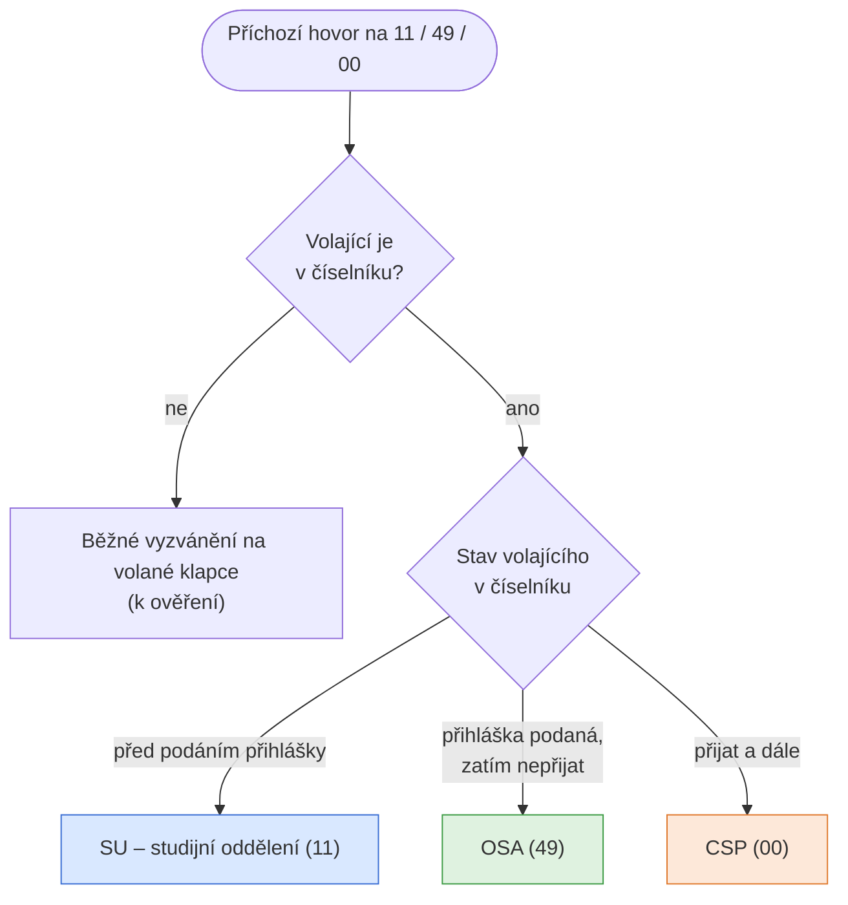
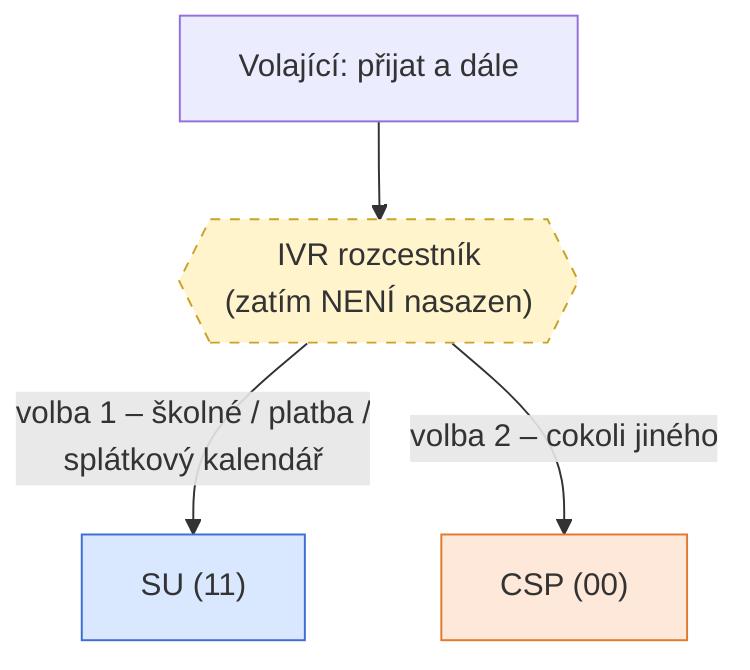
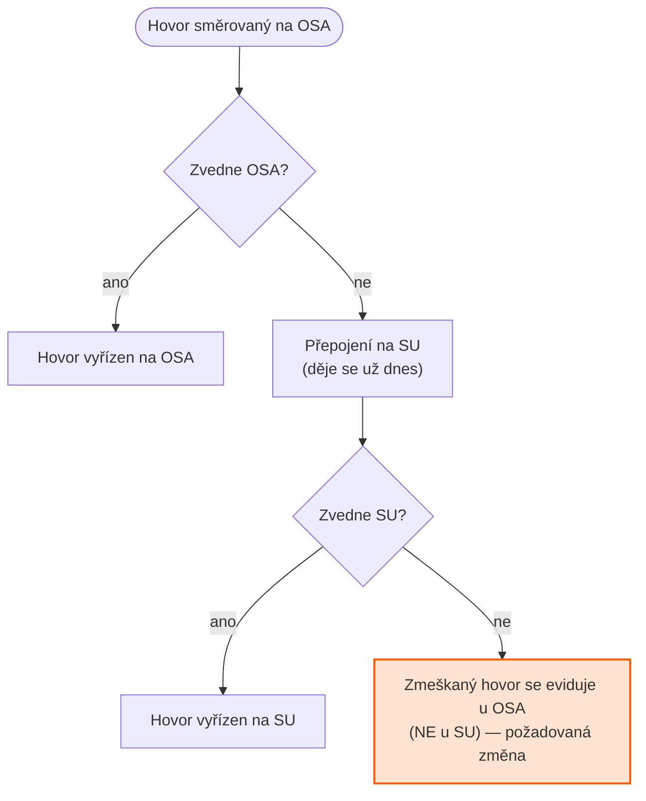

# Směrování příchozích hovorů (SU / OSA / CSP)

Jak se rozřazují příchozí hovory mezi oddělení podle toho, v jakém stavu je volající
v našem číselníku. Platí pro volání na kteroukoli z těchto klapek:

| Oddělení | Klapka |
|---|---|
| **SU** – studijní oddělení | `11` |
| **OSA** | `49` |
| **CSP** | `00` |

---

## Hlavní rozřazení podle stavu volajícího

> ⚠️ **Dnes platí:** kdo je „přijat a dále", padá **vždy rovnou na CSP**.
> IVR rozcestník níže zatím neexistuje.

## Plánované rozšíření: IVR rozcestník pro přijaté

Až bude rozcestník nasazen, přijatí volající nespadnou rovnou na CSP, ale nejdřív
uslyší volbu:

## Nedovolání na OSA — přepad na SU a evidence zmeškaného hovoru

Když se volající na OSA nedovolá, hovor se přepojí na SU (to už dnes funguje).
**Změna:** pokud hovor nezvedne ani SU, zmeškaný hovor se musí evidovat **u OSA**, ne u SU.

---

## Shrnutí pravidel

1. Volající **v číselníku** se rozřazuje podle stavu: před podáním přihlášky → **SU**,
   podaná a nepřijat → **OSA**, přijat a dále → **CSP**.
2. **Zatím** jdou všichni přijatí rovnou na CSP; **plán** je IVR rozcestník
   (1 = školné/platby → SU, 2 = ostatní → CSP).
3. Nedovolání na OSA → přepad na SU; když nezvedne ani SU, zmeškaný hovor
   **zůstává evidovaný u OSA**.

## Otevřené otázky (k ověření)

- **Hranice SU/OSA:** zadání říkalo „stav nižší než *přihláška přijata* → SU" a zároveň
  „*přihláška podaná* a nepřijat → OSA". Diagram předpokládá, že OSA pravidlo má přednost,
  tedy SU dostává jen stavy **před podáním přihlášky**. Potvrdit.
- **Volající mimo číselník:** co se s nimi děje? (Diagram zatím předpokládá běžné
  vyzvánění na volané klapce.)
- Platí přepad „nedovolání → SU" i pro hovory na **CSP**, nebo jen pro OSA?
