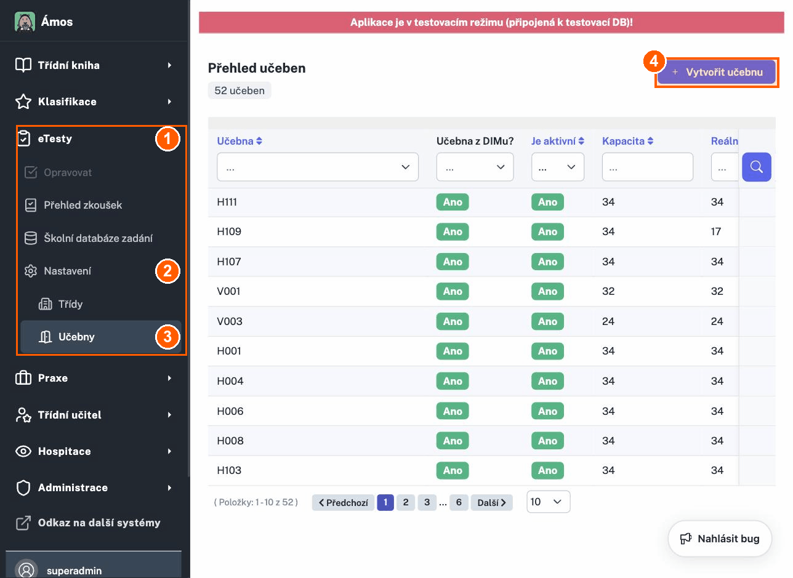
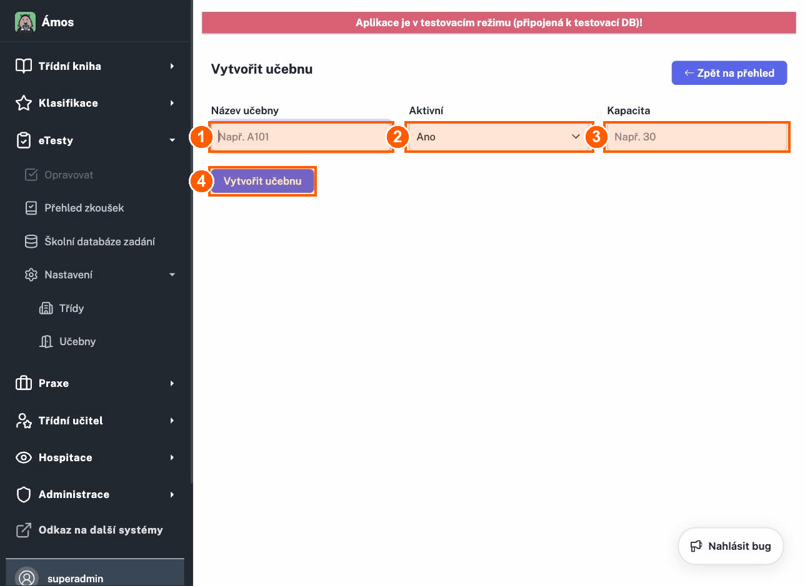
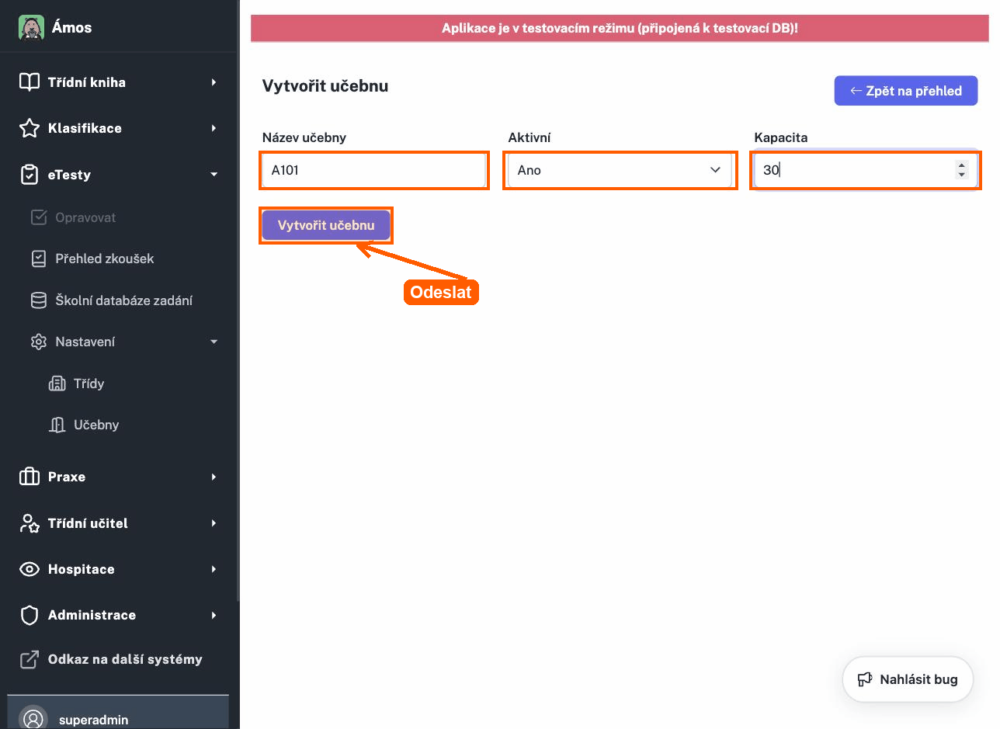
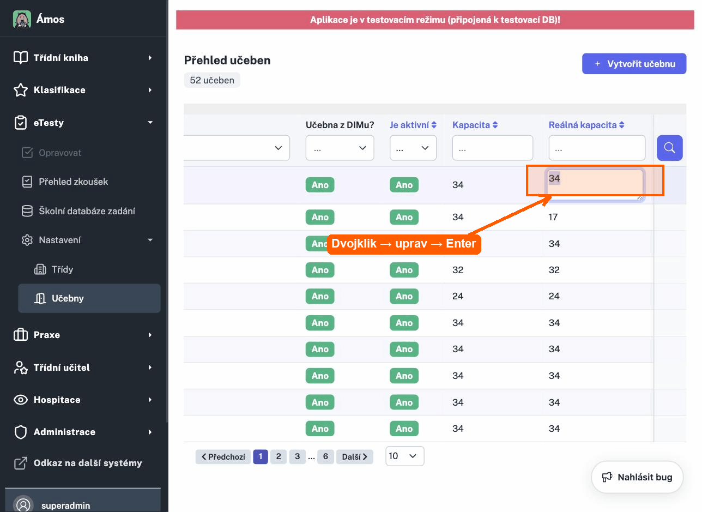

# Učebny — vytvoření a editace

Návod popisuje, jak v ETK spravovat **učebny**: kde je najdeš, kdo s nimi může pracovat,
jak založit novou učebnu, jak ji upravit a co znamenají jednotlivé proměnné (pole).

> Screenshoty jsou z testovacího prostředí `etkdev.ssgh.cz`. V ostrém provozu vypadá vše stejně,
> jen bez červeného pruhu „Aplikace je v testovacím režimu".

---

## Kde to najdu

Správa učeben je v levém menu pod **eTesty → Nastavení → Učebny**.
Přímý odkaz: `/admin/classrooms/`

1. **eTesty** – rozbal hlavní sekci.
2. **Nastavení** – podsekce.
3. **Učebny** – otevře *Přehled učeben*.
4. **Vytvořit učebnu** – tlačítko vpravo nahoře pro založení nové učebny.

---

## Kdo to může udělat

Do sekce se dostane pouze účet s **administrátorským oprávněním pro modul eTesty**
(v testu ověřeno pod účtem `superadmin`). Běžný učitel bez těchto práv položku
*eTesty → Nastavení → Učebny* v menu nevidí.

Oprávnění/role se přidělují v **Administrace → Osoby**.

> ⚠️ Přesné názvy rolí, které mají na správu učeben právo, je vhodné potvrdit se správcem
> ETK (může se lišit podle nastavení školy).

---

## Jak vytvořím novou učebnu

1. V *Přehledu učeben* klikni vpravo nahoře na **Vytvořit učebnu**
   (nebo jdi přímo na `/admin/classrooms/create`).
2. Vyplň formulář:

   1. **Název učebny** – označení místnosti (např. `A101`, `H111`).
   2. **Aktivní** – zda se učebna nabízí k použití (výchozí **Ano**).
   3. **Kapacita** – počet míst (např. `30`).
   4. **Vytvořit učebnu** – uloží novou učebnu.

3. Vyplněný formulář před uložením vypadá takto:

4. Po kliknutí na **Vytvořit učebnu** se vrátíš do *Přehledu učeben* a nová učebna
   se objeví v tabulce.

---

## Proměnné (pole formuláře)

| Pole v ETK | Interní název | Popis | Typ | Zadává se při vytvoření | Lze změnit později |
|---|---|---|---|---|---|
| **Název učebny** | `name` | Označení místnosti (A101, H111 …) | text | ano (povinné) | ne (z přehledu nelze) |
| **Aktivní** | `status` | Zda je učebna k dispozici (Ano/Ne) | výběr, výchozí *Ano* | ano | ne (z přehledu nelze) |
| **Kapacita** | `capacity` | Plánovaný / maximální počet míst | číslo | ano | ne (z přehledu nelze) |
| **Reálná kapacita** | `real_capacity` | Skutečně využitelný počet míst (může být nižší než kapacita) | číslo | ne (dopočítá se) | **ano — inline v tabulce** |
| **Učebna z DIMu?** | – | Zda je učebna napojená/importovaná z nadřazeného systému DIM | jen zobrazení | – | ne (read-only) |

---

## Jak učebnu edituji

Z *Přehledu učeben* lze **inline (přímo v tabulce) upravit jen „Reálnou kapacitu"**.

1. Ve sloupci **Reálná kapacita** klikni **dvakrát** na hodnotu u dané učebny.
2. Přepiš číslo.
3. Potvrď klávesou **Enter** (změna se uloží automaticky). Klávesou **Esc** úpravu zrušíš.

> ⚠️ **Omezení:** Název, Aktivní a Kapacitu **nelze** z přehledu po vytvoření změnit —
> u řádků není odkaz na plnou editaci a samostatná editační stránka není v UI dostupná.
> Pokud je potřeba upravit název/kapacitu/aktivitu existující učebny, řeš to prosím
> se správcem ETK. *(K ověření: zda má být plná editace učebny dostupná i z rozhraní.)*

---

## Přehled sloupců v tabulce

V *Přehledu učeben* jsou tyto sloupce (číslo vpravo nahoře, např. „52 učeben", ukazuje celkový počet):

- **Učebna** – název (řaditelné).
- **Učebna z DIMu?** – Ano/Ne, napojení na systém DIM.
- **Je aktivní** – Ano/Ne (řaditelné).
- **Kapacita** – plánovaný počet míst (řaditelné).
- **Reálná kapacita** – využitelný počet míst (řaditelné, editovatelné inline).

Nad tabulkou je u každého sloupce **filtr** (textové pole nebo výběr Ano/Ne); po zadání
potvrď tlačítkem s lupou. Vpravo dole lze přepnout počet položek na stránku (10 / 20 / 50 / 100 / vše).

---

## Rychlé shrnutí

- **Vytvoření:** eTesty → Nastavení → Učebny → *Vytvořit učebnu* → Název + Aktivní + Kapacita → uložit.
- **Editace:** v tabulce dvojklik na *Reálnou kapacitu* → přepsat → Enter.
- **Kdo:** účty s administrátorským právem pro eTesty (např. superadmin).
